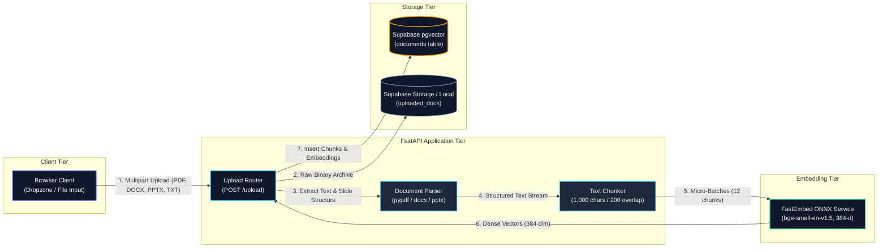
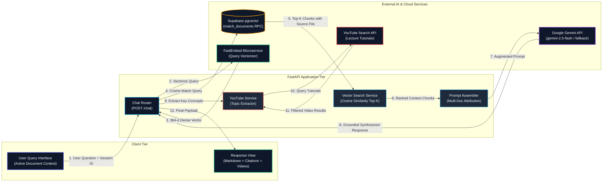
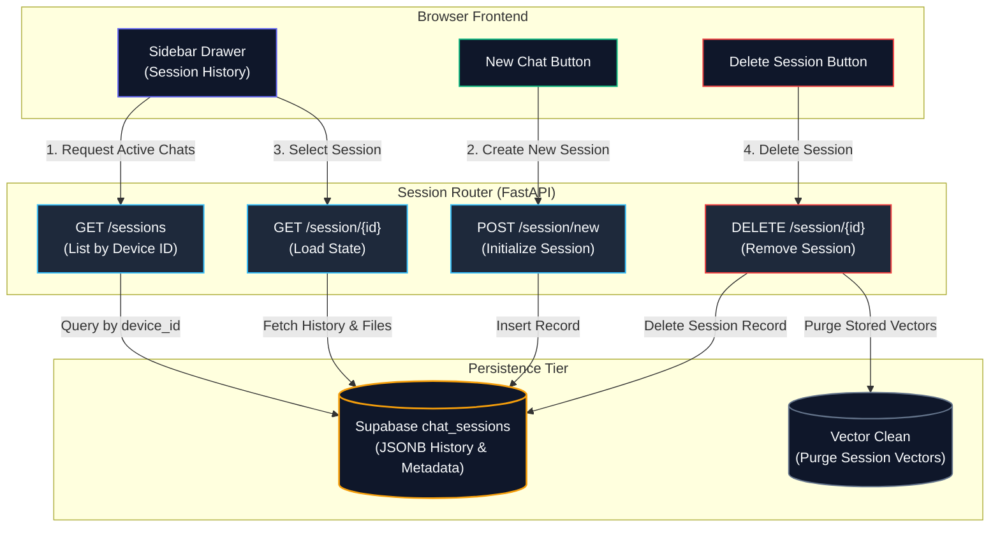
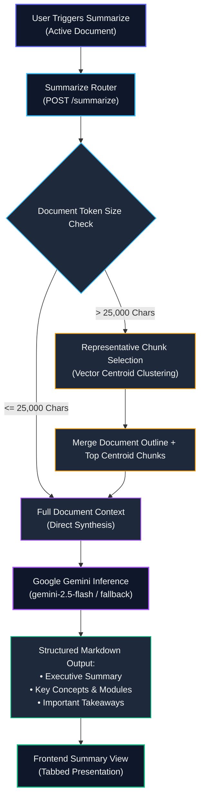

# Document AI Chatbot

A high-performance, full-stack Retrieval-Augmented Generation (RAG) system engineered for intelligent document analysis, side-by-side study material inspection, instant executive summarization, academic video recommendations, and multi-session contextual question answering powered by Google Gemini and FastEmbed ONNX vector embeddings.

---

## System Architecture & Workflows

To maintain clarity, low latency, and zero unnecessary API costs, the system decouples document ingestion, query retrieval, session management, and document summarization into dedicated pipelines.

### 1. Document Ingestion & Vector Indexing Pipeline (Write Path)
How documents are parsed, chunked, vectorized via a dedicated microservice without incurring LLM token costs, and indexed into pgvector storage:



---

### 2. Question Answering & Retrieval Pipeline (Read / RAG Path)
How user queries are vectorized, matched against indexed knowledge with multi-document attribution, synthesized by Google Gemini, and paired with curated educational video tutorials:



---

### 3. Multi-Session Lifecycle & History
How anonymous, device-isolated chat sessions are tracked, loaded, and deleted on demand:



---

### 4. Document Summarization Pipeline
How textbooks, presentation slide decks, and research reports are converted into executive summaries with representative chunk centroid ranking for large documents:



---

## Key Features

- **Decoupled Embedding Architecture**: High-speed vector embeddings served via a lightweight ONNX microservice (`BAAI/bge-small-en-v1.5`, 384 dimensions) — zero Google Gemini token consumption for vectorization and minimal RAM consumption (~140 MB main backend / ~110 MB embedding microservice).
- **Factual RAG Retrieval**: Multi-turn conversational question answering strictly grounded in uploaded documents with per-chunk source file labeling (`[Source: filename]`).
- **Persistent Session History**: ChatGPT-style history drawer tracking user conversations across devices with instant session switching and manual deletion.
- **Native Side-by-Side Document Viewer**: Embedded viewing modes for PDF, Word documents, PowerPoint presentations (slide outline, diagram zoom modal, speaker notes, and canvas theme toggle), and spreadsheets.
- **Contextual Educational Video Recommendations**: Extracts core conceptual subjects from query-answer pairs to surface top academic video tutorials from YouTube.
- **Executive Summaries**: One-click structured summaries with automatic centroid vector selection for documents exceeding prompt limits.
- **Resilient Multi-Tier LLM Fallbacks**: Automatic model fallback (`gemini-2.5-flash` to `gemini-1.5-flash`) and transparent API key rotation across rate limits (HTTP 429).
- **Multi-Format Compatibility**: Seamless extraction across `.pdf`, `.docx`, `.pptx`, and `.txt` files.

---

## Codebase Organization

The project follows a clean, modular structure separating API routing, business services, data schemas, and static frontend assets:

```text
Document-AI-Chatbot/
├── main.py                  # Application entrypoint, lifespan, CORS, static routes
├── config.py                # Environment configuration and service settings
├── routers/                 # Modular API route controllers
│   ├── chat.py              # RAG query processing and summarization endpoints
│   ├── documents.py         # File upload, text extraction, and vector indexing
│   └── sessions.py          # Session history lifecycle (CRUD operations)
├── services/                # Core business logic and external integrations
│   ├── document_loaders.py  # Multi-format parsers (pypdf, docx, pptx extraction)
│   ├── embeddings.py        # FastEmbed ONNX microservice client & local fallback
│   ├── llm.py               # Google Gemini client with key rotation and fallback
│   ├── session_store.py     # Supabase chat_sessions table & in-memory manager
│   ├── vector_search.py     # pgvector similarity matching & centroid selection
│   └── youtube.py           # Contextual YouTube video query service
├── models/                  # Pydantic schemas and data validation models
├── static/                  # Production frontend assets
│   ├── css/styles.css       # Enterprise dark theme styles
│   └── js/app.js            # Frontend application logic, UI state, and handlers
├── index.html               # Main responsive single-page web application
├── render.yaml              # Multi-service Render deployment specification
└── requirements.txt         # Production Python dependencies
```

---

## Tech Stack

| Layer | Technologies |
| :--- | :--- |
| **Frontend** | Vanilla HTML5, Modern CSS3 (Glassmorphism, Dark Theme), JavaScript ES6+ |
| **Backend API** | Python 3.10+, FastAPI, Uvicorn, Pydantic |
| **Embedding Engine** | FastEmbed (`BAAI/bge-small-en-v1.5`), ONNX Runtime (384 dimensions) |
| **LLM Inference** | Google Gemini (`gemini-2.5-flash`, `gemini-1.5-flash`) via `google-genai` |
| **Document Parsers** | `pypdf`, `python-docx`, `python-pptx`, `Pillow` |
| **Database & Vectors** | Supabase PostgreSQL + `pgvector` (with in-memory local fallback) |
| **Deployment** | Render Cloud Platform (Free Tier Blueprint) |

---

## Running Locally

### 1. Clone the Repository
```bash
git clone https://github.com/mani30mk/Document-AI-Chatbot.git
cd Document-AI-Chatbot
```

### 2. Set Up Virtual Environment
```powershell
python -m venv .venv
.venv\Scripts\Activate.ps1
pip install -r requirements.txt
```

### 3. Configure Environment Variables
Create a `.env` file in the root directory:
```env
GEMINI_API_KEY="your-gemini-api-key"
EMBEDDING_SERVICE_URL="https://document-ai-chatbot-7ch2.onrender.com"

# Optional: Supabase Persistent Storage
SUPABASE_URL="https://your-project.supabase.co"
SUPABASE_KEY="your-supabase-key"
```

### 4. Start the Application
```bash
uvicorn main:app --reload --port 8000
```
Open **`http://localhost:8000`** in your browser. The application will initialize automatically and connect to the local backend.

---

## Deploy to Render

This repository includes a multi-service configuration in [`render.yaml`](render.yaml) optimized for Render's **Free Tier**:

| Service | Role | Memory Footprint |
| :--- | :--- | :--- |
| **`document-ai-chatbot`** | Web Application & Chatbot UI | ~140 MB / 512 MB |
| **`document-ai-embeddings`** | FastEmbed ONNX Microservice | ~110 MB / 512 MB |

### One-Click Blueprint Setup
1. Push your repository to GitHub.
2. In the [Render Dashboard](https://dashboard.render.com), click **New +** → **Blueprint**.
3. Connect your repository — Render provisions both web services automatically.
4. Add your `GEMINI_API_KEY` in the environment variables configuration.

---

## Supabase Database & Session Persistence Setup

To persist vector embeddings and chat sessions permanently across container restarts:

1. Create a project at [supabase.com](https://supabase.com).
2. Open the **SQL Editor** in the Supabase Dashboard and run the following schema:

```sql
-- 1. Enable pgvector extension
create extension if not exists vector;

-- 2. Documents table for 384-dimensional FastEmbed vectors
create table if not exists documents (
  id uuid primary key default gen_random_uuid(),
  content text,
  metadata jsonb,
  embedding vector(384)
);

-- 3. Match documents RPC for cosine similarity search
create or replace function match_documents (
  query_embedding vector(384),
  filter jsonb default '{}'::jsonb,
  match_count int default 4
) returns table (
  id uuid,
  content text,
  metadata jsonb,
  similarity float
)
language plpgsql
as $$
#variable_conflict use_column
begin
  return query
  select
    id,
    content,
    metadata,
    1 - (documents.embedding <=> query_embedding) as similarity
  from documents
  where metadata @> filter
  order by documents.embedding <=> query_embedding
  limit match_count;
end;
$$;

-- 4. Chat sessions table for persistent conversation history
create table if not exists chat_sessions (
  session_id text primary key,
  device_id text,
  title text not null default 'New chat',
  files jsonb not null default '[]'::jsonb,
  docs jsonb not null default '{}'::jsonb,
  slides jsonb not null default '{}'::jsonb,
  messages jsonb not null default '[]'::jsonb,
  history jsonb not null default '[]'::jsonb,
  active_doc text,
  created_at timestamptz not null default now(),
  updated_at timestamptz not null default now()
);

create index if not exists idx_chat_sessions_device_id on chat_sessions (device_id);
create index if not exists idx_chat_sessions_updated_at on chat_sessions (updated_at desc);
```

3. Create a public storage bucket named **`documents`** under **Storage**.
4. Set `SUPABASE_URL` and `SUPABASE_KEY` in your environment variables.
