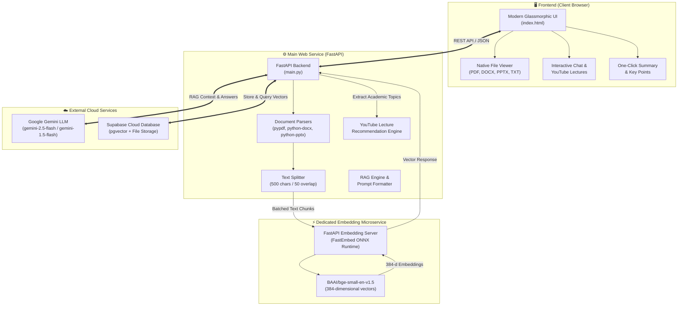
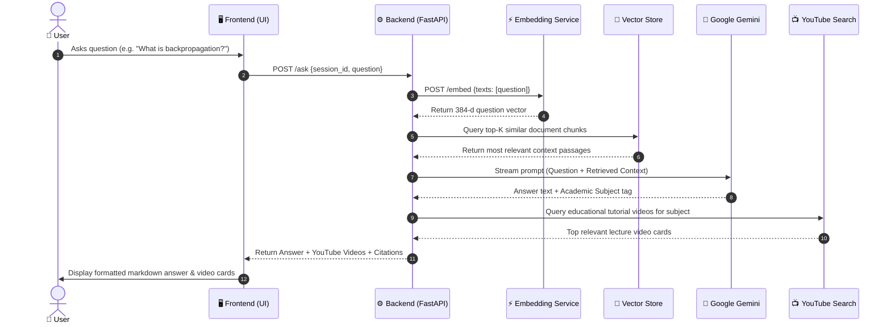
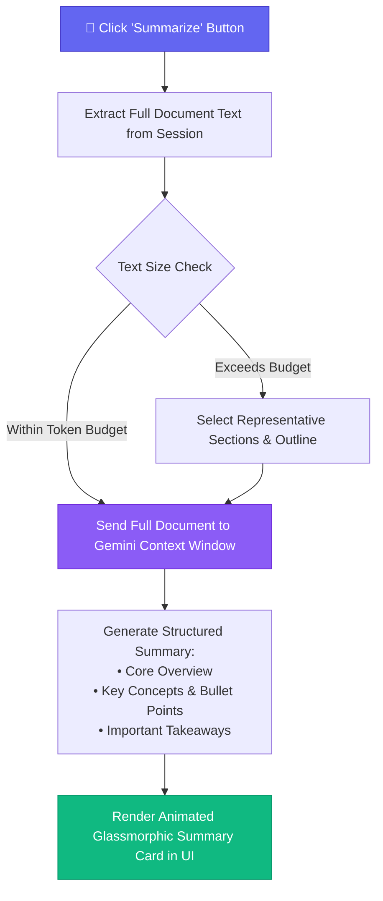

# Document AI Chatbot 📚🤖

A modern, full-stack Retrieval-Augmented Generation (RAG) application that allows you to upload study materials, view them natively in your browser side-by-side, generate one-click summaries, search relevant educational lecture videos, and ask detailed questions using Google's Gemini models.

---

## 🏗️ System Architecture

The application is built using a decoupled **Two-Service Microservice Architecture** designed to maximize speed, save API token costs, and stay well within free-tier cloud limits:



---

## 🔄 End-to-End Processing Flowcharts

### 1. Document Ingestion & Vector Indexing Pipeline

When you upload a document, it is automatically processed, parsed, chunked, and vectorized:

```mermaid
flowchart LR
    A["📄 Upload File<br/>(.pdf, .docx, .pptx, .txt)"] --> B["🔍 Extract Text & Metadata"]
    B --> C["✂️ Split into Chunks<br/>(Chunk Size: 500, Overlap: 50)"]
    C --> D["⚡ Send Micro-Batches<br/>(8 chunks per HTTP request)"]
    D --> E["🧠 Generate Embeddings<br/>(FastEmbed ONNX 384-d)"]
    E --> F["💾 Save to Vector Store<br/>(Supabase pgvector / Memory)"]
    F --> G["✅ Document Ready for Chat"]

    style A fill:#4f46e5,stroke:#312e81,color:#fff
    style D fill:#0284c7,stroke:#0369a1,color:#fff
    style E fill:#059669,stroke:#047857,color:#fff
    style G fill:#16a34a,stroke:#15803d,color:#fff
```



---

### 2. Question Answering (RAG) & YouTube Recommendations

When you ask a question, the assistant retrieves relevant context, queries the LLM, and discovers educational video tutorials:



---

### 3. One-Click Document Summarization Pipeline

Summarize entire textbooks, slide decks, or lecture notes instantly:



---

## ✨ Key Features

- **Decoupled Architecture**: High-speed embeddings served via dedicated ONNX microservice — **0 Google API tokens** spent on vectorization and minimal RAM footprint (~140 MB main app / ~110 MB embedding service).
- **RAG Chatbot**: Chat with multi-page PDFs, lecture presentations, and research papers with strict factual grounding.
- **Native Document Viewer**: Side-by-side reading experience with PDF viewer and rendered text preview.
- **Context-Aware YouTube Recommendations**: Identifies key academic concepts from questions and answers to recommend high-quality educational lecture videos.
- **One-Click Instant Summaries**: Synthesize long documents into executive summaries and bulleted study guides.
- **Automatic Fallbacks & Key Rotation**: Multi-tier LLM fallback (`gemini-2.5-flash` → `gemini-1.5-flash`) with automatic API key rotation on rate limits (429).
- **Multi-Format Support**: `.pdf`, `.docx`, `.pptx`, `.txt`.

---

## 🛠️ Tech Stack

| Layer | Technologies |
| :--- | :--- |
| **Frontend** | Vanilla HTML5, Modern CSS3 (Glassmorphism, Dark Theme), JavaScript ES6+ |
| **Backend API** | Python 3.11, FastAPI, Uvicorn, Pydantic |
| **Embedding Engine** | FastEmbed (`BAAI/bge-small-en-v1.5`), ONNX Runtime (384 dimensions) |
| **LLM Inference** | Google Gemini (`gemini-2.5-flash`, `gemini-1.5-flash`) via `google-genai` |
| **File Parsing** | `pypdf`, `python-docx`, `python-pptx`, `Pillow` |
| **Database & Vectors** | Supabase PostgreSQL + `pgvector` (with in-memory fallback) |
| **Deployment** | Render Cloud Platform (Free Tier Blueprint) |

---

## 🚀 Running Locally

### 1. Clone the Repository
```bash
git clone https://github.com/mani30mk/Document-AI-Chatbot.git
cd Document-AI-Chatbot
```

### 2. Set Up Virtual Environment
```powershell
python -m venv .venv
.venv\Scripts\Activate.ps1
pip install -r requirements.txt
```

### 3. Configure Environment Variables
Create a `.env` file in the root directory:
```env
GEMINI_API_KEY="your-gemini-api-key"
EMBEDDING_SERVICE_URL="https://document-ai-chatbot-7ch2.onrender.com"

# (Optional) Supabase Persistent Storage
SUPABASE_URL="https://your-project.supabase.co"
SUPABASE_KEY="your-supabase-key"
```

### 4. Start the Application
```bash
uvicorn main:app --reload --port 8000
```
Open **`http://localhost:8000`** in your browser. The app connects automatically and is ready to use!

---

## 🌐 Deploy to Render

This repository includes a multi-service configuration in [`render.yaml`](render.yaml) configured for Render's **Free Tier**:

| Service | Role | Memory Footprint |
| :--- | :--- | :--- |
| **`document-ai-chatbot`** | Web Application & Chatbot UI | ~140 MB / 512 MB |
| **`document-ai-embeddings`** | FastEmbed ONNX Microservice | ~110 MB / 512 MB |

### One-Click Blueprint Setup
1. Push your repository to GitHub.
2. In the [Render Dashboard](https://dashboard.render.com), click **New +** → **Blueprint**.
3. Connect your repository — Render will automatically provision both web services.
4. Add your `GEMINI_API_KEY` in the environment variables tab.

---

## 🗄️ (Optional) Supabase Vector Database Setup

To persist vectors permanently across container restarts:
1. Create a project at [supabase.com](https://supabase.com).
2. Run the SQL schema script in Supabase's SQL Editor:
```sql
create extension if not exists vector;

create table if not exists documents (
  id uuid primary key default gen_random_uuid(),
  content text,
  metadata jsonb,
  embedding vector(384)
);

create or replace function match_documents (
  query_embedding vector(384),
  filter jsonb default '{}'::jsonb,
  match_count int default 4
) returns table (
  id uuid,
  content text,
  metadata jsonb,
  similarity float
)
language plpgsql
as $$
#variable_conflict use_column
begin
  return query
  select
    id,
    content,
    metadata,
    1 - (documents.embedding <=> query_embedding) as similarity
  from documents
  where metadata @> filter
  order by documents.embedding <=> query_embedding
  limit match_count;
end;
$$;
```
3. Create a public storage bucket named **`documents`**.
4. Set `SUPABASE_URL` and `SUPABASE_KEY` in your environment.
